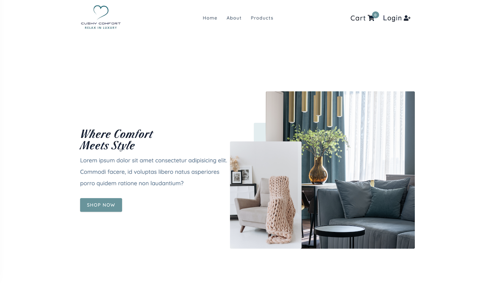

## Cushy Comfort

`Cushy Comfort` is an e-commerce web application built with `React`, designed to showcase a curated selection of furniture products for users to explore and purchase. Leveraging React `Context API`, users can effortlessly filter products by category, company, price range, color, and free shipping options. The seamless navigation and routing within the app are powered by the latest version of `React Router 6`. 
The app offers a streamlined checkout experience, enabling payment processing through the `Stripe API integration`. Ensuring data privacy and secure user authentication, the app integrates the `AuthO` authentication service.

### Tech Stack
- `JavaScript`
- `React`: The powerful JavaScript library used to build the project.
- `React Router 6`: For seamless navigation and routing within the application.
- `AuthO`: For secure user authentication and authorization.
- `Stripe API`: For safe and efficient payment processing during checkout.
- `Axios`: For efficient handling of API requests and data management.
- `Formspree`: For smooth communication with the store's team through easy form submissions.
- `Netlify Functions`: For serverless backend functionality to enhance application responsiveness.
- `Styled Components`: For creating stylish and responsive designs.
- `React Icons`: For incorporating iconic visuals throughout the app.

### Explore The Website
[Cushy Comfort on Netlify](https://cushy-comfort.netlify.app/)

### Preview

